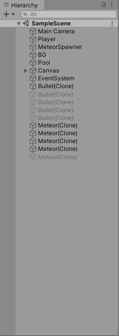
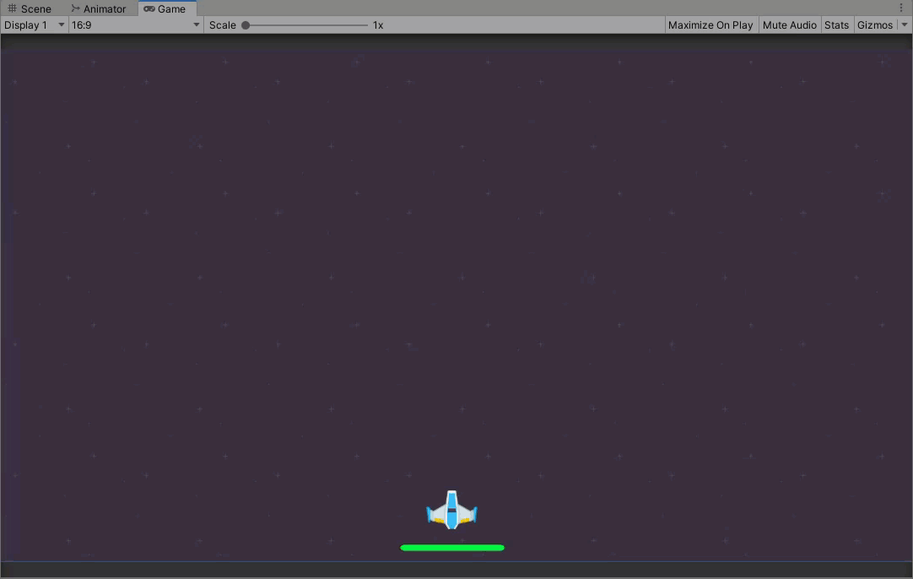

# Object Pooling in Unity/Object Pooling en Unity

_This is a project to used as example, where Object Pooling design pattern is implemented_

_Este es un proyecto para ser usado como ejemplo, donde se implementa el patron de diseño Object Pooling_


### Pre requirements/Pre-requisitos 📋

_Unity Version_

```
2019.3.5f1
```

## Preview 🛠️



## Expresiones de Gratitud 🎁

* Comenta a otros sobre este proyecto 📢
* Invita una cerveza 🍺 o un café ☕ a alguien del equipo. 
* Da las gracias públicamente 🤓.
* etc.


